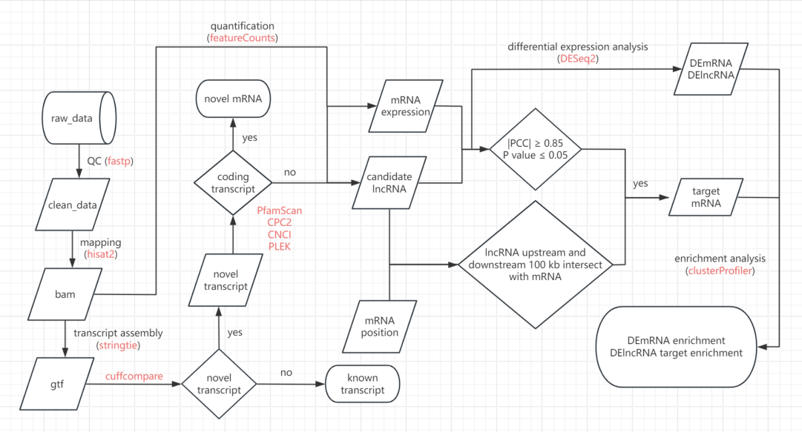
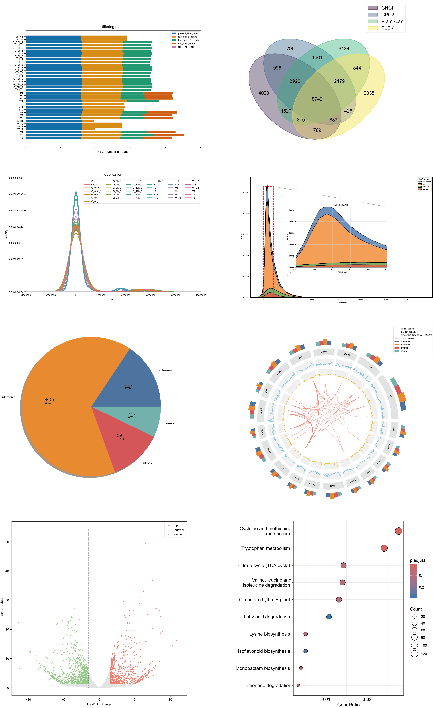
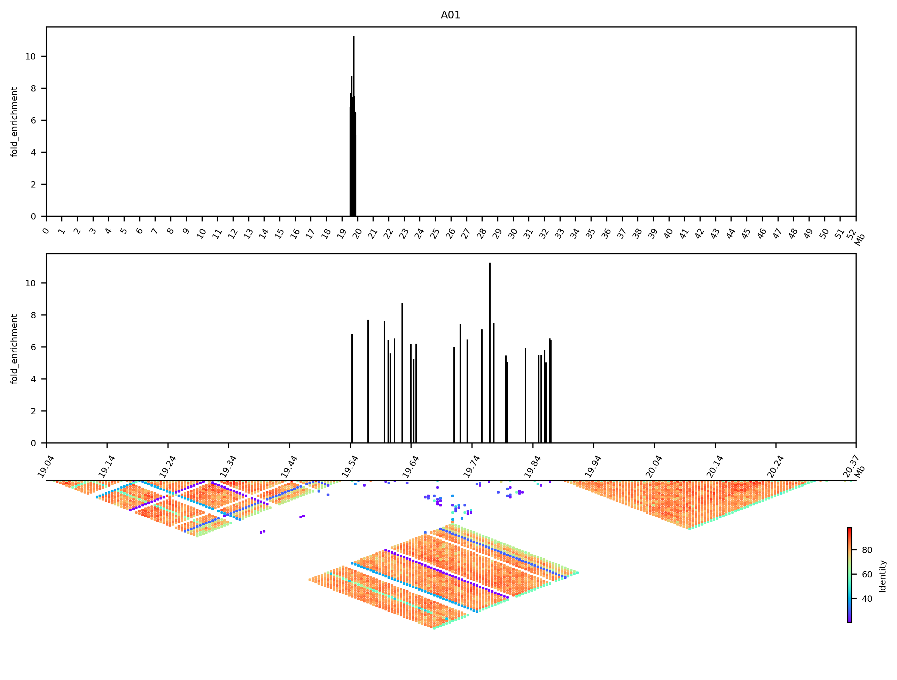
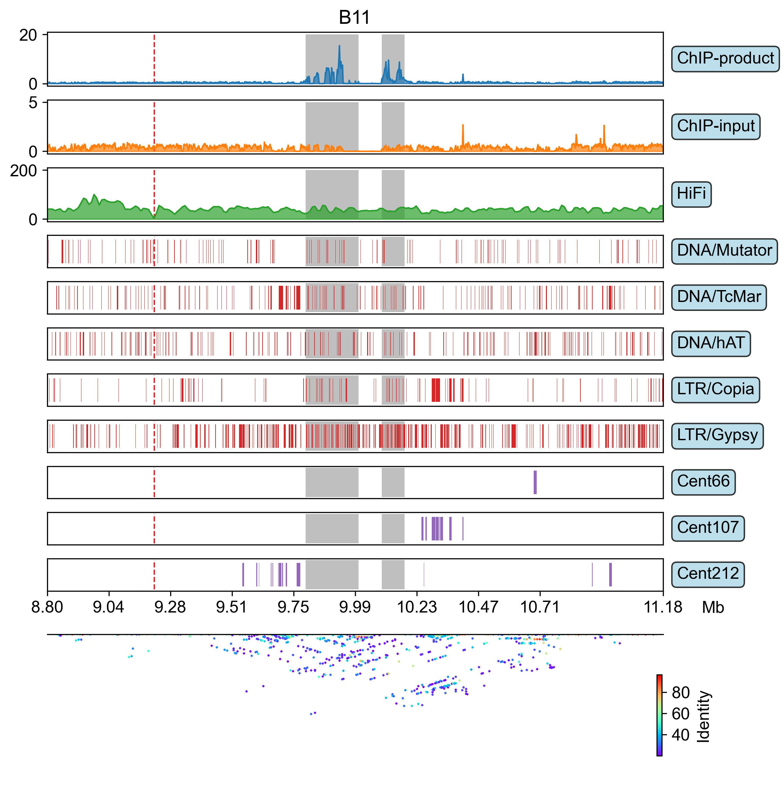
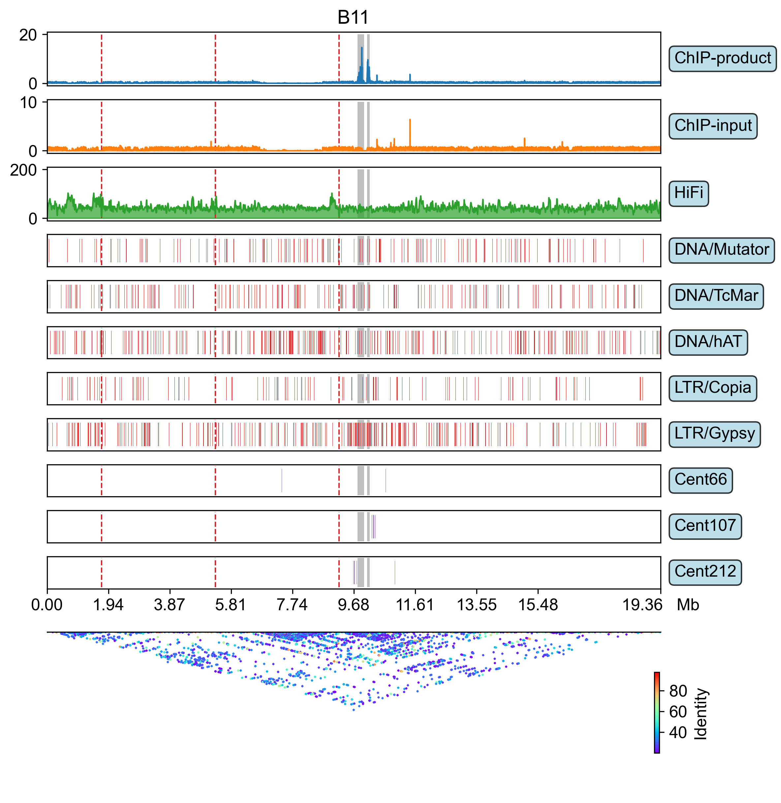
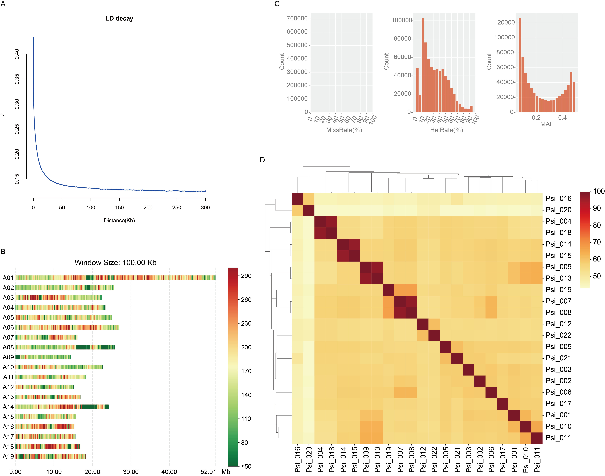

<a id="link1"></a>
# BioWorkflowSuite (BWS) : Bioinformatic workflow suite.

- [Introduction](#introduction)
- [Install](#install)
- [User guide](#user-guide)
  - [1. LncRNAs and target genes prediction](#1-lncrnas-and-target-genes-prediction)
    - [**1.1 Dependency software**](#11-dependency-software)
    - [**1.2 Get started**](#12-get-started)
    - [**1.3 How it works**](#13-how-it-works)
    - [**1.4 Output directory structure**](#14-output-directory-structure)
    - [**1.5 Major result files**](#15-major-result-files)
    - [**1.6 Example result figure**](#16-example-result-figure)
  - [ 2. Monocentric centromere identification based on ChIP-seq](#-2-monocentric-centromere-identification-based-on-chip-seq)
    - [**2.1 Dependency software**](#21-dependency-software)
    - [**2.2 Get started**](#22-get-started)
    - [**2.3 Major results**](#23-major-results)
    - [**2.4 Example result figure**](#24-example-result-figure)
  - [3. Centromere landscape visualization](#3-centromere-landscape-visualization)
    - [**3.1 Dependency software**](#31-dependency-software)
    - [**3.2 Get started**](#32-get-started)
      - [**3.2.1. Identification and clustering of tandem repeat sequences**](#321-identification-and-clustering-of-tandem-repeat-sequences)
      - [**3.2.2. Generate reads tracks**](#322-generate-reads-tracks)
      - [**3.2.3. Centromere landscape visualization**](#323-centromere-landscape-visualization)
  - [4. Genetic structure analysis](#4-genetic-structure-analysis)
    - [**4.1 Dependency software**](#41-dependency-software)
    - [**4.2 Get started**](#42-get-started)
    - [**4.3 Example result figure**](#43-example-result-figure)
  - [5. Haplotype genome allele analysis](#5-haplotype-genome-allele-analysis)
    - [**5.1 Dependency software**](#51-dependency-software)
    - [**5.2 Get started**](#52-get-started)
      - [**5.2.1 Allele identification**](#521-allele-identification)
      - [**5.2.2 Allele expression pattern clustering (AEPC)**](#522-allele-expression-pattern-clustering-aepc)
      - [**5.2.3 Allele-specific expression (ASE) analysis**](#523-allele-specific-expression-ase-analysis)
      - [**5.2.4 Allele-specific TE insertion**](#524-allele-specific-te-insertion)

## Introduction
**It is a bioinformatics integrated tool platform, aiming to uniformly manage, schedule and execute various 
bioinformatics tools and analysis processes.**

## Install
```shell
# python >= 3.8
pip install bws --upgrade -i http://192.168.31.13:8080 --trusted-host 192.168.31.13
```

## User guide
### 1. LncRNAs and target genes prediction
#### **1.1 Dependency software**
1. Make sure the R interpreter for the current environment variable have installed these packages:
   1. [x] DESeq2 (v1.46.0)
   2. [x] clusterProfiler (v4.14.0)
2. Make sure these commands can be found in your current environment variable:
   1. [x] fastp (v0.21.0): https://github.com/OpenGene/fastp
   2. [x] hisat2 (v2.2.1): https://daehwankimlab.github.io/hisat2/download
   3. [x] samtools (v1.22): https://github.com/samtools/samtools
   4. [x] stringtie (v2.2.3): https://github.com/gpertea/stringtie
   5. [x] gffread (v0.12.8): https://github.com/gpertea/gffread
   6. [x] cuffcompare (v2.2.1): https://github.com/cole-trapnell-lab/cufflinks
   7. [x] featureCounts (v2.0.8): https://subread.sourceforge.net
   8. [x] pfam_scan.pl: http://ftp.ebi.ac.uk/pub/databases/Pfam/Tools
   9. [x] CPC2.py (v1.0.0): https://github.com/gao-lab/CPC2_standalone
   10. [x] CNCI.py: https://github.com/www-bioinfo-org/CNCI
   11. [x] PLEK (v1.2): https://sourceforge.net/projects/plek/files
   12. [x] bedtools (v2.31.1): https://github.com/arq5x/bedtools2
   13. [x] seqkit (v2.8.2): https://github.com/shenwei356/seqkit
#### **1.2 Get started**
```shell
# Create config file.
ssRNA-seq_pipeline  # Then fill or modify the parameters inside ssRNA_seq_pipeline.yml.

# Create commands.
ssRNA-seq_pipeline ssRNA_seq_pipeline.yml

# If commands create successfully, run as follow command:
bash /your/path/to/out_dir/shell/All_step.sh
```
- `ssRNA_seq_pipeline.yml` see [template](bws/config_template/ssRNA_seq_pipeline.yml)
- `sample_info` param in `ssRNA_seq_pipeline.yml` config file see [template](example/lncRNA_analysis_pipeline/sample.info.xls)
- `enrich_anno_file` param in `ssRNA_seq_pipeline.yml` config file see [template](example/lncRNA_analysis_pipeline/KEGG_anno.xls)<br />
**You can obtain KEGG annotations through the following steps:**
```shell
# First get whole genome protein sequence and upload to eggnog-mapper (http://eggnog-mapper.embl.de/).
gffread genome.gff3 -g genome.fa -y genome.pep.fa

# The csv result file will be available in a few minutes.
# Then, download csv result file and execute the following command to extract the 
# correspondence between KEGG pathways and genes.
eggnog_mapper_helper extract_KEGG_GO_term -i eggnog_mapper_results.csv -o .

# Or run eggnog-mapper at local host
mkdir -p emapper_out/tmp
emapper.py \
  --cpu 20 \
  --mp_start_method forkserver \
  --data_dir /mnt/sda/database/eggnog-mapper \
  -o out_prefix \
  --output_dir emapper_out \
  --temp_dir emapper_out/tmp \
  --override \
  -m diamond \
  --dmnd_ignore_warnings \
  -i genome.pep.fa \
  --evalue 0.001 \
  --score 60 \
  --pident 40 \
  --query_cover 20 \
  --subject_cover 20 \
  --itype proteins \
  --tax_scope auto \
  --target_orthologs all \
  --go_evidence non-electronic \
  --pfam_realign none \
  --excel \
  --report_orthologs \
  --decorate_gff yes

# Then extract KEGG and GO term
eggnog_mapper_helper extract_KEGG_GO_term -i emapper_out/out_prefix.emapper.annotations

# You also need the KEGG annotations of allied species (eg. poplar).
eggnog_mapper_helper KEGG_anno -n pop -o pop
# You can use the following commands to look up the abbreviations of species names.
wget -c https://rest.kegg.jp/list/organism
# For more customized KEGG databases, please refer to the KEGG API 
# (https://www.kegg.jp/kegg/rest/keggapi.html).

# Finally, joint the two tables and format them properly.
joint -i <(sed '1iko\tgene' KEGG.xls) -I <(cut -f 8,9 pop | sed '1iko\tdesc')

awk '$2 != "NA" && $3 != "NA"' joint.xls | sed '1d' | sed 's/ $//' | \
  awk -F'\t' '{print $2,$1,$3}' OFS='\t' > KEGG_anno.xls
```
#### **1.3 How it works**

#### **1.4 Output directory structure**
```
/your/path/to/out_dir
├── 01.QC
├── 02.mapping
├── 03.assembly
├── 04.expression
├── 05.lncRNA_prediction
├── 06.lncRNA_target_prediction
├── 07.lncRNA_classification
├── 08.mRNA_differential_expression_analysis
├── 09.lncRNA_differential_expression_analysis
├── 10.DEmRNA_enrich
├── 11.DElncRNA_target_enrich
└── shell
```
#### **1.5 Major result files**
- /your/path/to/out_dir/04.expression/FPKM.fc.xls  # all transcript (lncRNAs and mRNAs) expression (FPKM)
- /your/path/to/out_dir/04.expression/TPM.fc.xls  # all transcript (lncRNAs and mRNAs) expression (TPM)
- /your/path/to/out_dir/05.lncRNA_prediction/lncRNA.fa  # lncRNAs sequence
- /your/path/to/out_dir/06.lncRNA_target_prediction/lncRNA_exp/FPKM.fc.xls  # lncRNAs expression (FPKM)
- /your/path/to/out_dir/06.lncRNA_target_prediction/lncRNA_exp/TPM.fc.xls  # lncRNAs expression (TPM)
- /your/path/to/out_dir/06.lncRNA_target_prediction/target_exp/FPKM.fc.xls  # mRNAs expression (FPKM)
- /your/path/to/out_dir/06.lncRNA_target_prediction/target_exp/TPM.fc.xls  # mRNAs expression (TPM)
- /your/path/to/out_dir/06.lncRNA_target_prediction/co_loc.xls  # lncRNAs co-location target genes
- /your/path/to/out_dir/06.lncRNA_target_prediction/filter_co_exp.xls  # lncRNAs co-expression target genes after FDR filter
- /your/path/to/out_dir/07.lncRNA_classification/co_loc.xls  # lncRNAs co-expression target genes after FDR filter (additional lncRNA classification information)
#### **1.6 Example result figure**

**For more details on customizing Circos plot parameters, such as ideogram configuration, track styling, 
and color mapping, please refer to the [documentation](https://github.com/wenlinXu-njfu/GenomeCircos).**

### <a id="link2"></a> 2. Monocentric centromere identification based on ChIP-seq
#### **2.1 Dependency software**
1. [x] fastp (v0.21.0): https://github.com/OpenGene/fastp
2. [x] bowtie2 (v2.4.2): https://bowtie-bio.sourceforge.net/bowtie2/index.shtml
3. [x] samblaster (v0.1.26): https://github.com/GregoryFaust/samblaster
4. [x] samtools (v1.22): https://github.com/samtools/samtools
5. [x] macs2 (v2.2.9.1): https://github.com/macs3-project/MACS/wiki/Install-macs2
6. [x] bedtools (v2.31.1): https://github.com/arq5x/bedtools2
7. [x] StainedGlass (v0.6): https://github.com/mrvollger/StainedGlass [optional]
#### **2.2 Get started**
```shell
# Create config file.
centromere_identifier  # Then fill or modify the parameters inside.

# Create commands.
centromere_identifier centromere_identification.yml

# If commands create successfully, run as follow command:
bash /your/path/to/out_dir/shell/All_step.sh
```
- `centromere_identification.yml` see [template](bws/config_template/centromere_identification.yml)
- `sample_info` param in centromere_identification.yml config file see [template](example/centromere_identification/sample.info.xls)
#### **2.3 Major results**
- /your/path/to/out_dir/04.centromere/sample_name/*_peaks.png  # ChIP peak figure
- /your/path/to/out_dir/04.centromere/sample_name/sample_name_centromere_pos.xls  # centromere info
- /your/path/to/out_dir/04.centromere/sample_name/sample_name_centromere_seq.fa  # centromere sequence
#### **2.4 Example result figure**


### 3. Centromere landscape visualization
Structurally, the centromere is mainly composed of repetitive sequences (including tandem repeats and transposons). 
Among them, the centromere tandem repeat sequences are arranged in a tandem repeat manner, forming higher-order repeat 
units (HORs). Multiple higher-order repeat units are further concatenated to form an alpha satellite DNA array with a 
total length ranging from 200 kb to 5 Mb. This highly repetitive and complex sequence structure is a typical hallmark 
of the centromere in the genome and is an important basis for bioinformatics prediction and annotation.
#### **3.1 Dependency software**
1. [x] TRASH: https://github.com/vlothec/TRASH
2. [x] MMseq2 (version: eaecacf4ba24e9c8a0f2a1da115603ebc80710ad): https://github.com/soedinglab/MMseqs2
3. [x] seqkit (v2.8.2): https://github.com/shenwei356/seqkit
#### **3.2 Get started**
**Suppose you have completed the previous work of [identifying the centromeres](#link2), 
and the current working path is the output directory for the centromere identification.**<br />
##### **3.2.1. Identification and clustering of tandem repeat sequences**
```shell
# step1: run TRASH without template file
TRASH_run.sh sample1.genome.fa --o TRASH_out --par 8

# step2: cluster the tandem repeat (TR) sequences
TR_analyser cluster \
  TRASH_out/all.repeats.from.sample1.genome.fa.csv \  # TRASH result file
  TRASH_out/TRASH_sample1.genome.fa.gff \  # TRASH result file
  -k 0 \  # K-mer length (0: automatically set to optimum).  [default: 0]
  -ml 7 \  # Minimum monomer length.  [default: 7]
  -mi 0.5 \  # Minimum monomer identity.  [default: 0.5]
  -mc 0.95 \  # List matches above this fraction of aligned (covered) residues.  [default: 0.95]
  -cm 5 \  # Coverage mode. {0|1|2|3|4|5}  [default: 5]
  -o 05.TR_cluster/sample1  # Output path.  [default: $PWD]
```
##### **3.2.2. Generate reads tracks**
```shell
mkdir -p 06.tracks/sampl1

# step3: hifi reads mapping to genome
meryl count k=21 output 02.mapping/sample1/genome_21mer.meryl sample1.genome.fa

meryl print greater-than distinct=0.9998 02.mapping/sample1/genome_21mer.meryl > 02.mapping/sample1/repetitive_k21.txt

winnowmap \
  -k 21 \
  -W 02.mapping/sample1/repetitive_k21.txt \
  -ax map-pb sample1.genome.fa /your/path/to/HiFi.fastq.gz | \
  samtools sort -@ 14 - | \
  samtools view -bF 2308 -q 20 -e '[NM] <= 100' - | \
  bam_tools filtration -q 20 -l 10000 -c 0.95 -sp -o 02.mapping/sample1/HiFi.sort.filtered.bam -

samtools index 02.mapping/sample1/HiFi.sort.filtered.bam

# step4: generate reads tracks
bamCoverage \
  --normalizeUsing BPM \
  -b 02.mapping/sample1/sample1_ChIP.bt2.markdup.sort.filtered.bam \
  -o 06.tracks/sample1/ChIP-product.bw

bamCoverage \
    --normalizeUsing BPM \
    -b 02.mapping/sample1/sample1_Input.bt2.markdup.sort.filtered.bam \
    -o 06.tracks/sample1/ChIP-input.bw

bamCoverage \
  --normalizeUsing BPM \
  -b 02.mapping/sample1/HiFi.sort.filtered.bam \
  -o 06.tracks/sample1/HiFi.bw
```
##### **3.2.3. Centromere landscape visualization**
```shell
# step5: show reads and HOR tracks
TR_analyser cent_landscape \
  06.tracks/sample1/ChIP-product.bw \
  06.tracks/sample1/ChIP-input.bw \
  06.tracks/sample1/HiFi.bw \  # [optional] Show HiFi reads tracks. It can also display the depth of other types of sequencing reads.
  -c 04.centromere/sample1/centromere_pos.xls \  # Generated by macs2_helper cent_identifier.
  -i 05.StainedGlass/sampl1/StainedGlass.full.tbl.gz \  # [optional] StainedGlass results.
  -C rainbow \  # Color map of sequence identity. (if "-i" option is specified)
  -e 500000 \  # Extension length of centromere region. [default: 500000]
  -tr 05.TR_cluster/sampl1/monomer.final.gff3 \  # Generated by step2, the 9th column must contain the "Cluster" and "Width" attributes.
  -te sample1.TE.gff3 \  # [optional] Transposon annotation file, the 9th column must contain the "Class" attribute.
  --TE \  # Drawing the most abundant transposable element (TE) in the centromere region among the first n ("-N" option) types, rather than the centromere extension region ("-e" option).
  -g <(fasta_tools gap_location sampl1.genome.fa) \  # [optional] Gap position information file. (BED format)
  -b 2000 \  # Bin size of reads depth statistics. This argument can be specified more than once, corresponding to different "bigwig" files.  [default: 10000]
  -b 2000 \
  -b 10000 \
  -n 3 \  # Visualization of the top n most abundant tandem repeat monomers.  [default: 3]
  -N 5 \  # Visualization of the top n most abundant transposons (if "-te" option specified).  [default: 5]
  -o 07.HOR/sample1  # Output path.  [default: $PWD]
```

- **The gray shading indicates the centromere region and the red dotted line indicates the gap position.**
- **For `-i` option to show TR identity, [the analysis script is as shown previously.](#link3)
For show whole chromosome, by set `-e` option value very large (greater than maximum chromosome).**
```shell
TR_analyser cent_landscape \
  06.tracks/sampl1/ChIP.bw \
  06.tracks/sampl1/Input.bw \
  06.tracks/sampl1/HiFi.bw \
  -c 04.centromere/sample1/centromere_pos.xls \
  -i 05.StainedGlass/sampl1/StainedGlass.full.tbl.gz \
  -C rainbow \
  -e 100000000 \
  -tr 05.TR_cluster/sampl1/monomer.final.gff3 \
  -te sample1.TE.gff3 \
  --TE \
  -g <(fasta_tools gap_location sampl1.genome.fa) \
  -b 2000 \
  -b 2000 \
  -b 10000 \
  -n 3 \
  -o 07.HOR/sample1_global
```


### 4. Genetic structure analysis
#### **4.1 Dependency software**
1. [x] fastp (v0.21.0): https://github.com/OpenGene/fastp
2. [x] bwa (v0.7.17-r1198-dirty): https://github.com/lh3/bwa
3. [x] samtools (v1.22): https://github.com/samtools/samtools
4. [x] gatk (v4.1.0.0): https://github.com/broadinstitute/gatk
5. [x] vcftools (v0.1.16): https://vcftools.github.io/
6. [x] BioPyPlot (v0.0.0): https://github.com/wenlinXu-njfu/BioPyPlot
7. [x] BioFileKit (v0.1.1): https://github.com/wenlinXu-njfu/BioFileKit
8. [x] PopLDdecay (v3.43): https://github.com/BGI-shenzhen/PopLDdecay
9. [x] gffread (v0.12.8): https://github.com/gpertea/gffread
10. [x] ANNOVAR: https://annovar.openbioinformatics.org/en/latest/user-guide/download/
11. [x] bcftools (v1.21): https://github.com/samtools/bcftools
12. [x] plink (v1.9.0-b.7.10): https://www.cog-genomics.org/plink/
13. [x] admixture (v1.3.0): https://dalexander.github.io/admixture/
#### **4.2 Get started**
```shell
# Create config file.
genetic_structure_analysis  # Then fill or modify the parameters inside ssRNA_seq_pipeline.yml.

# Create commands.
genetic_structure_analysis genetic_structure_analysis.yml
# Or build genome index automatically.
genetic_structure_analysis genetic_structure_analysis.yml --build-database

# If commands create successfully, run as follow command:
bash /your/path/to/out_dir/shell/All_step.sh
```
- `genetic_structure_analysis.yml` see [template](bws/config_template/genetic_structure_analysis.yml)
- `sample_info` param see [template](example/variant_calling/sample.info.xls)
#### **4.3 Example result figure**


### 5. Haplotype genome allele analysis
#### **5.1 Dependency software**
1. [x] bedtools (v2.31.1): https://github.com/arq5x/bedtools2
#### **5.2 Get started**
##### **5.2.1 Allele identification**<a id="link3"></a>
Based on SNP variants identified by the SyRI tool between two haplotypic genomes, 
consecutive blocks sharing the same SNP marker are defined as "alleles" 
(Haplotype blocks based on collinearity and SNP linkage). 
However, this identification method yields allelic pairs with four possible patterns:

- 1:1 – Both collinear blocks contain exactly one allele per haplotype.
- 1:N – The collinear block contains one allele in haplotype A but N (N > 1) alleles in haplotype B.
- M:1 – The collinear block contains M (M > 1) alleles in haplotype A but only one allele in haplotype B.
- M:N – Both haplotypes contain more than one allele within the collinear block.<br />

Ideally, for each haplotype locus, the alleles located on that locus should be unique. 
If the number of alleles of the two haplotypes is unbalanced, it indicates that one may have 
undergone fragment expansion (1:N), deletion (M:1) or even complex structural rearrangement (M:N) in that region.
```shell
allele_analyser allele_identifier \
  -r hapA.fai \  # haplotype A genome sequence index file
  -R hapA.gff3 \  # haplotype A genome gene annotation file
  -q hapB.fai \  # haplotype B genome sequence index file
  -Q hapB.gff3 \  # haplotype B genome gene annotation file
  -l 1000 \  # gene flank regions length
  -o all_allele_pairs.xls \  # output file
  syri.out  # variant file generated by SyRI
```
```text
Allele_block_id      Block_type  Pair_type_in_block  ID_x                   Chromosome_x  Start_x  End_x   ID_y                   Chromosome_y  Start_y  End_y
Allele_block_000001  1:1         1:1                 Posim.A01G000100.v1.0  Chr01         15281    24727   Posim.B01G000200.v1.0  Chr01         29063    38499
Allele_block_000002  1:N         1:N                 Posim.A01G000200.v1.0  Chr01         58539    61428   Posim.B01G000300.v1.0  Chr01         66213    72548
Allele_block_000002  1:N         1:N                 Posim.A01G000300.v1.0  Chr01         59800    62162   Posim.B01G000300.v1.0  Chr01         66213    72548
Allele_block_000003  1:1         1:1                 Posim.A01G000800.v1.0  Chr01         74907    77726   Posim.B01G000400.v1.0  Chr01         84391    87207
Allele_block_000004  1:1         1:1                 Posim.A01G000900.v1.0  Chr01         89270    93152   Posim.B01G000500.v1.0  Chr01         98801    102683
Allele_block_000005  1:1         1:1                 Posim.A01G001000.v1.0  Chr01         100831   104607  Posim.B01G000600.v1.0  Chr01         110441   114217
Allele_block_000006  M:N         M:N                 Posim.A01G001100.v1.0  Chr01         109662   115576  Posim.B01G000700.v1.0  Chr01         119253   125167
Allele_block_000006  M:N         M:N                 Posim.A01G001100.v1.0  Chr01         109662   115576  Posim.B01G000800.v1.0  Chr01         124543   131587
Allele_block_000006  M:N         M:N                 Posim.A01G001200.v1.0  Chr01         114956   122011  Posim.B01G000700.v1.0  Chr01         119253   125167
```
- column 1: Allele block.
- column 2: The ratio of the number of alleles at this allele block for the two haplotypes ([as mentioned before](#link3)).
- column 3: Pairwise relationship in allele block, this column indicates the allelic pairing complexity between the two haplotypes for the specific gene pair in this row. It follows the format `M:N`, where:
  - `M` = Number of allele copies from Haplotype A (`ID_x`) that are paired with this specific copy from Haplotype B (`ID_y`) within the block.
  - `N` = Number of allele copies from Haplotype B (`ID_y`) that are paired with this specific copy from Haplotype A (`ID_x`) within the block.
  - Key Patterns:
    - `1:1` = Simple one-to-one allelic pair (both haplotypes have a single copy).
    - `1:N` = One allele from Haplotype A pairs with multiple alleles from Haplotype B (copy number expansion in B).
    - `M:1` = Multiple alleles from Haplotype A pair with one allele from Haplotype B (copy number expansion in A).
    - `M:N` = Complex many-to-many relationships (both haplotypes have multiple copies).
- column 4: The unique gene identifier from Haplotype A that participates in this specific pairwise alignment within the allele block.
- column 5: The chromosome name (or scaffold ID) in Haplotype A on which the gene `ID_x` is located.
- column 6: The start coordinate (0‑based or 1‑based, as defined in the genome annotation) of gene `ID_x` on `Chromosome_x`.
- column 7: The end coordinate of gene ID_x on Chromosome_x. Together with Start_x, this defines the genomic interval of the allele in Haplotype A.
- column 8: The unique gene identifier from Haplotype B that is aligned with `ID_x` in this row.
- column 9: The chromosome name (or scaffold ID) in Haplotype B for gene `ID_y`.
- column 10: The start coordinate of gene `ID_y` on `Chromosome_y`.
- column 11: The end coordinate of gene `ID_y` on `Chromosome_y`. Defines the genomic interval of the allele in Haplotype B.

##### **5.2.2 Allele expression pattern clustering (AEPC)**
```shell
cut -f 1,4,8 all_allele_pairs.xls > allele_pairs.xls

allele_analyser AEPC \
  -m 0 \  # minimum expression level threshold
  -cm kmeans \  # clustering method
  -k 10 \  # number of cluster
  -p 0.05 \  # significance threshold of clustering
  -o kmeans \  # output path
  FPKM.xls \  # gene expression matrix
  allele_pairs.xls  # allele pairs (loci_id\tallele1_id\tallele2_id)
```

##### **5.2.3 Allele-specific expression (ASE) analysis**
```shell
allele_analyser ASE \
        <(awk '{if($2 == "1:1"){print $4"\n"$8}}' all_allele_pairs.xls | sort -uV | grep -Fwf - gene.FPKM.xls | cat <(head -1 gene.FPKM.xls) -) \
        <(awk '$2 == "1:1"' all_allele_pairs.xls | cut -f 1,4,8) \
        -M t_test \  # significant difference expression calculation method
        -m 0.5 \  # the minimum expression threshold in all tissues
        -n 10 \  # number of processing
        -o t_test.xls  # output file
```
```text
Allele_block_000001  Posim.A01G000100.v1.0  Posim.B01G000200.v1.0  -3.143050358343374   0.05154166209065529   1.447550319421646   5.167151459426987   3.557696752252369   3.712655956225444   2.7317160259793334  5.827841778620276   3.879807106694138   4.146704575302922
Allele_block_000011  Posim.A01G002800.v1.0  Posim.B01G002400.v1.0  1.0                  0.39100221895577053   0.0944399989744638  0.5813933844175533  0.453341232300029   0.9933882071391024  0.0944399989744638  0.5798753860248181  0.453341232300029   0.9933882071391024
Allele_block_000013  Posim.A01G003300.v1.0  Posim.B01G002800.v1.0  -4.796401070353253   0.017243270943384438  1.880935095508816   1.8899539468930129  2.035087172980827   0.7190297377962146  1.9057901605817     1.930026961415911   2.083939726333708   0.7377276043322522
Allele_block_000015  Posim.A01G003600.v1.0  Posim.B01G003100.v1.0  NA                   NA                    0.5844907679069131  0.4788493288790476  0.4910881477368067  0.2937388584663985  0.5844907679069131  0.4788493288790476  0.4910881477368067  0.2937388584663985
Allele_block_000016  Posim.A01G003700.v1.0  Posim.B01G003200.v1.0  3.861005586487609    0.030712138475979818  0.5932166365169319  1.1387723077752607  1.0141581805148785  2.0687399638245947  0.2825734356666763  0.5087034613820351  0.4622263597979664  0.952664022504688
Allele_block_000017  Posim.A01G003800.v1.0  Posim.B01G003300.v1.0  -2.6235066715124424  0.07876346291649909   0.3345830775390376  3.0520486227018853  1.2331283919832892  1.916437829528381   0.8913073786900592  3.3870704254133983  1.3765154143069274  2.00076109402763
Allele_block_000018  Posim.A01G003900.v1.0  Posim.B01G003400.v1.0  3.638010051060887    0.03579166381768695   2.557248590955437   11.670715647024984  6.245211270957242   10.921984997316132  1.8241354894702917  8.352315216448757   4.442077839781835   7.611382862135742
Allele_block_000019  Posim.A01G004000.v1.0  Posim.B01G003500.v1.0  1.2470891648294513   0.30085607705718725   0.5088007769168013  3.5208811174162387  2.669044605479728   3.06048138403834    0.5091816158216791  3.5190201865930804  2.669044605479728   3.0594168687743264
Allele_block_000020  Posim.A01G004100.v1.0  Posim.B01G003600.v1.0  1.6381234663619886   0.1999223339259976    0.1755043076840485  1.024652041122554   1.356706850194233   3.3184568081444605  0.175407982597504   1.0240896634929588  1.3559622251392416  3.315192368237623
Allele_block_000022  Posim.A01G004800.v1.0  Posim.B01G004100.v1.0  0.2520990495373248   0.8172490467308878    2.9150182215047407  1.9094567432397385  8.677782347760655   2.9732863549659867  2.9150182215047407  1.9103340493473604  8.677782347760655   2.9719480917253134
```
- column 1: allele block id
- column 2: hapA allele id
- column 3: hapB allele id
- column 4: t statistic
- column 5: p value
- column 6-N: allele expression of hapA and hapB respectively
##### **5.2.4 Allele-specific TE insertion**
```shell
# extract ASE gene annotation
awk '$5 <= 0.05' t_test.xls | awk '{print $2"\n"$3}' | sort -uV | sed 's/.v1.0//' | grep -f - gene.gff3 > ASE.gene.gff3

# Allele-specific TE insertion analysis
RepeatMasker_helper TE_anno \
  ASE.gene.gff3 \
  TE.gff3 \  # the 9th column must have a "Class" attribute (TE class, eg Class=LTR/Gypsy).
  -l 2000 | \  # gene flank regions length
  sort -uV > ASE_TE_anno.xls
```
```text
repeat_000313  DNA/hAT/nMITE   Posim.A01G003300.v1.0    downstream
repeat_000314  DNA/hAT/MITE    Posim.A01G003300.v1.0    downstream
repeat_000318  LTR/Gypsy       Posim.A01G003300.v1.0    downstream
repeat_000320  LTR/Gypsy       Posim.A01G003300.v1.0    downstream
repeat_000321  LTR/Gypsy       Posim.A01G003300.v1.0    downstream
repeat_000322  DNA/TcMar/MITE  Posim.A01G003300.1.v1.0  exon
repeat_000322  DNA/TcMar/MITE  Posim.A01G003300.1.v1.0  three_prime_UTR
repeat_000322  DNA/TcMar/MITE  Posim.A01G003300.2.v1.0  exon
repeat_000322  DNA/TcMar/MITE  Posim.A01G003300.2.v1.0  three_prime_UTR
repeat_000322  DNA/TcMar/MITE  Posim.A01G003300.3.v1.0  exon
```
- column 1: TE id
- column 2: TE class
- column 3: gene id
- column 4: gene structure

[Back to top](#link1)